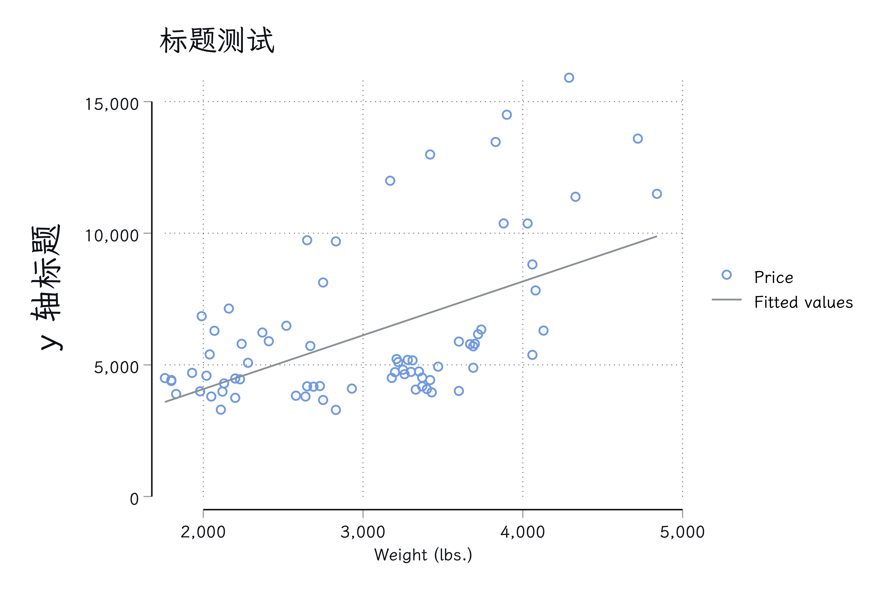
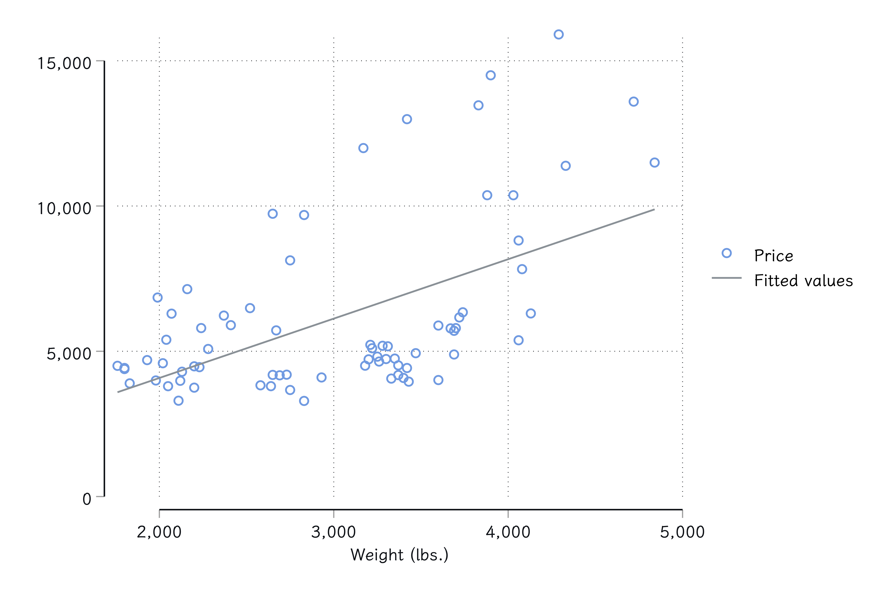
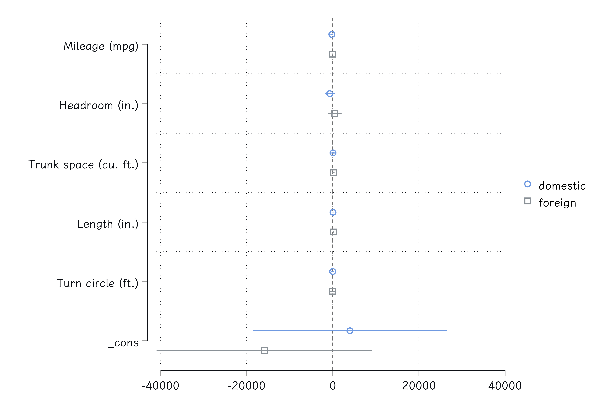
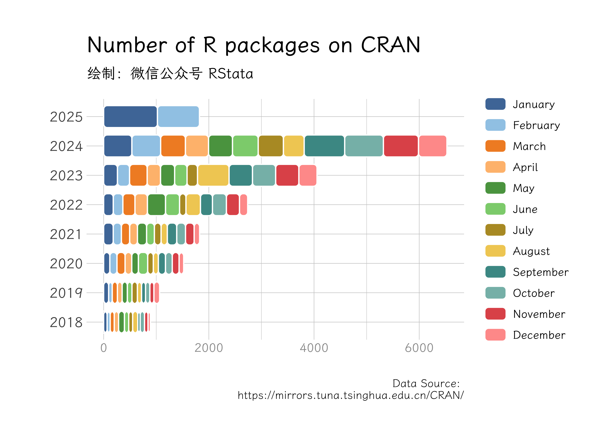

在 Markdown 中使用 Stata
================
微信公众号 RStata
2025-02-23

这篇文档用以测试在 Markdown 文件中插入 Stata
代码，然后进行编译。编译过程中会自动执行代码、保存代码输出结果、保存图片，然后再把结果和图片插入到文档中。不过在这个过程中也要遵循一些基本规则。

## 整体 Stata 代码

Stata 中通常使用 `///` 符号进行代码换行，不过也有一些例外，例如编写
program，这种情况需要使用 `{stata asis}` 来声明代码块，例如：

``` stata
cap program drop myexp_lf 
program myexp_lf
  version 14
  args lnfj lambda 
  quietly replace `lnfj' = log(`lambda') - `lambda' * $ML_y1
end
```

input 输入数据的时候也经常会遇到这个问题：

``` stata
clear
input y
2.1
2.2
3.1
1.6
2.5
0.5
end
```

整篇文档的代码会被作为一个整体运行，所以不同代码块里面的代码是可以连贯运行的：

``` stata
ml model lf myexp_lf (y = ) 
ml maximize, nolog 
*> initial:       log likelihood =     -<inf>  (could not be evaluated)
*> feasible:      log likelihood = -10.158883
*> rescale:       log likelihood = -10.158883
*>                                                              Number of obs = 6
*>                                                              Wald chi2(0)  = .
*> Log likelihood = -10.158883                                  Prob > chi2   = .
*> ------------------------------------------------------------------------------
*>            y | Coefficient  Std. err.      z    P>|z|     [95% conf. interval]
*> -------------+----------------------------------------------------------------
*>        _cons |         .5   .2041241     2.45   0.014      .099924     .900076
*> ------------------------------------------------------------------------------
```

当代码块被声明为 `{stata asis}`
的时候，这部分代码会直接保存到结果文档中，因此不能把含有结果输出的代码放到这个代码块里面，否则你讲不会得到任何结果输出。

``` stata
clear 
input x1 x2 y
1  0  0
1  1  1
0  0  0
0  1  0
end
```

于是，我们单独放置回归代码，这样才能确保输出结果也保存到结果文档中：

``` stata
reg y x1 x2 
*>       Source |       SS           df       MS      Number of obs   =         4
*> -------------+----------------------------------   F(2, 1)         =      1.00
*>        Model |          .5         2         .25   Prob > F        =    0.5774
*>     Residual |         .25         1         .25   R-squared       =    0.6667
*> -------------+----------------------------------   Adj R-squared   =    0.0000
*>        Total |         .75         3         .25   Root MSE        =        .5
*> ------------------------------------------------------------------------------
*>            y | Coefficient  Std. err.      t    P>|t|     [95% conf. interval]
*> -------------+----------------------------------------------------------------
*>           x1 |         .5         .5     1.00   0.500    -5.853102    6.853102
*>           x2 |         .5         .5     1.00   0.500    -5.853102    6.853102
*>        _cons |       -.25   .4330127    -0.58   0.667    -5.751948    5.251948
*> ------------------------------------------------------------------------------
```

## 普通代码（有文本结果输出）

普通代码块使用 `{stata}` 直接声明即可。

下面是一段需要执行的代码：

``` stata
sysuse auto, clear 
*> (1978 automobile data)
list price weight rep78 in 1/10
*>      +-------------------------+
*>      |  price   weight   rep78 |
*>      |-------------------------|
*>   1. |  4,099    2,930       3 |
*>   2. |  4,749    3,350       3 |
*>   3. |  3,799    2,640       . |
*>   4. |  4,816    3,250       3 |
*>   5. |  7,827    4,080       4 |
*>      |-------------------------|
*>   6. |  5,788    3,670       3 |
*>   7. |  4,453    2,230       . |
*>   8. |  5,189    3,280       3 |
*>   9. | 10,372    3,880       3 |
*>  10. |  4,082    3,400       3 |
*>      +-------------------------+
```

不想要执行的代码需要使用 `stata` 声明：

``` stata
这是一段不想要被执行的代码，毕竟直接执行会报错！
```

## 绘图代码（有图表输出）

不管是否有图表生成，每个代码块在编译的时候都会被尝试保存图片，因此不要把多个图表生成代码放到一个代码块里面，否则也是会产生错误的结果。

如果该代码块有图表生成，程序会自动把结果插入到结果文档中：

``` stata
sysuse auto, clear 
*> (1978 automobile data)
tw /// 
sc price weight || /// 
lfit price weight, /// 
    ti("标题测试") /// 
    yti("y 轴标题", /// 
        size(*2))
```



不使用 `///` 进行代码换行也是可以的：

``` stata
sysuse auto, clear 
*> (1978 automobile data)
tw sc price weight || lfit price weight
```



再例如使用 coefplot 命令绘图：

``` stata
sysuse auto
*> (1978 automobile data)
regress price mpg headroom trunk /// 
    length turn if foreign == 0
*>       Source |       SS           df       MS      Number of obs   =        52
*> -------------+----------------------------------   F(5, 46)        =      3.90
*>        Model |   145742460         5    29148492   Prob > F        =    0.0049
*>     Residual |   343452340        46  7466355.23   R-squared       =    0.2979
*> -------------+----------------------------------   Adj R-squared   =    0.2216
*>        Total |   489194801        51  9592054.92   Root MSE        =    2732.5
*> ------------------------------------------------------------------------------
*>        price | Coefficient  Std. err.      t    P>|t|     [95% conf. interval]
*> -------------+----------------------------------------------------------------
*>          mpg |  -218.4576   162.8462    -1.34   0.186    -546.2499    109.3347
*>     headroom |  -710.5966   579.0558    -1.23   0.226    -1876.176    454.9823
*>        trunk |   46.94429   175.9435     0.27   0.791    -307.2117    401.1003
*>       length |   46.53995   53.68823     0.87   0.391    -61.52884    154.6087
*>         turn |  -27.75574   183.0077    -0.15   0.880    -396.1312    340.6197
*>        _cons |   3974.614   11204.48     0.35   0.724    -18578.83    26528.06
*> ------------------------------------------------------------------------------
estimates store domestic 
regress price mpg headroom trunk length turn if foreign==1
*>       Source |       SS           df       MS      Number of obs   =        22
*> -------------+----------------------------------   F(5, 16)        =      8.62
*>        Model |   105293573         5  21058714.7   Prob > F        =    0.0004
*>     Residual |  39069639.5        16  2441852.47   R-squared       =    0.7294
*> -------------+----------------------------------   Adj R-squared   =    0.6448
*>        Total |   144363213        21   6874438.7   Root MSE        =    1562.6
*> ------------------------------------------------------------------------------
*>        price | Coefficient  Std. err.      t    P>|t|     [95% conf. interval]
*> -------------+----------------------------------------------------------------
*>          mpg |  -60.04633   72.57605    -0.83   0.420    -213.9007    93.80802
*>     headroom |   463.4583   742.3428     0.62   0.541    -1110.238    2037.155
*>        trunk |   138.7539   122.5353     1.13   0.274    -121.0094    398.5172
*>       length |   138.4445   36.53955     3.79   0.002     60.98406    215.9048
*>         turn |  -67.18482   346.4303    -0.19   0.849    -801.5843    667.2147
*>        _cons |   -15877.4   11820.27    -1.34   0.198    -40935.26    9180.448
*> ------------------------------------------------------------------------------
estimates store foreign
coefplot domestic foreign, xline(0)
```



由于一些特殊的原因，代码换行后的缩进建议使用四个空格而非制表符，否则会得到不美观的输出结果。

## 超长结果输出测试

下面是一段超长的代码输出测试：

``` stata
di "这是一段无比无比无比长的代码这是一段无比无比无比长的代码这是一段无比无比无比长的代码这是一段无比无比无比长的代码这是一段无比无比无比长的代码这是一段无比无比无比长的代码这是一段无比无比无比长的代码这是一段无比无比无比长的代码这是一段无比无比无比长的代码这是一段无比无比无比长的代码这是一段无比无比无比长的代码这是一段无比无比无比长的代码这是一段无比无比无比长的代码这是一段无比无比无比长的代码这是一段无比无比无比长的代码这是一段无比无比无比长的代码这是一段无比无比无比长的代码这是一段无比无比无比长的代码这是一段无比无比无比长的代码这是一段无比无比无比长的代码"
*> 这是一段无比无比无比长的代码这是一段无比无比无比长的代码这是一段无比无比无比长的代码这是一段无比无比无比长的代码这是一段无比无比无比长的代码这是一段无比无比无比长的代码这是一段无比无比无比长的代码这是一段无比无比无比长的代码这是一段无比无比无比长的代码这是一段无比无比无比长的代码这是一段无比无比无比长的代码这是一段无比无比无比长的代码这是一段无比无比无比长的代码这是一段无比无比无比长的代码这是一段无比无比无比长的代码这是一段无比无比无比长的代码这是一段无比无比无比长的代码这是一段无比无比无比长的代码这是一段无比无比无比长的代码这是一段无比无比无比长的代码
```

也可以得到比较美观的结果。

## 数学公式

行内公式使用方法，比如这个化学公式：$a^2 + b^2 = c^2$(`\(a^2 + b^2 = c^2\)`)，也可以用美元符号：$a^2 + b^2 = c^2$(`$a^2 + b^2 = c^2$`)

块公式使用方法如下：

$$H(D_2) = -\left(\frac{2}{4}\log_2 \frac{2}{4} + \frac{2}{4}\log_2 \frac{2}{4}\right) = 1$$

矩阵：

$$
  \begin{pmatrix}
  1 & a_1 & a_1^2 & \cdots & a_1^n \\
  1 & a_2 & a_2^2 & \cdots & a_2^n \\
  \vdots & \vdots & \vdots & \ddots & \vdots \\
  1 & a_m & a_m^2 & \cdots & a_m^n \\
  \end{pmatrix}
$$

块公式用 `$$ ... $$` 也是可以的。

## R 语言代码

由于该程序是使用 RMarkdown 进行编译的，所以 R 语言的代码也可以用于其中：

``` r
# 设置字体
library(showtext)
showtext_auto(enable = TRUE)
font_add("cnfont", bold = "~/Library/Fonts/LXGWWenKai-Medium.ttf",
         regular = "~/Library/Fonts/LXGWWenKai-Regular.ttf",
         italic = "~/Library/Fonts/LXGWWenKai-Light.ttf")
font_add("enfont", regular = "/Users/ac/Documents/font/CascadiaCode-Regular-VTT.ttf")

library(rvest)
library(tidyverse)
# lubridate 是处理日期的一个 R 包
library(lubridate)
library(hrbrthemes)

# 需要耐心地等待一会儿
pkg <- "https://mirrors.tuna.tsinghua.edu.cn/CRAN/web/packages/available_packages_by_date.html" %>%
  read_html() %>%
  html_table() %>%
  .[[1]] %>%
  as_tibble() %>%
  mutate(
    Date = ymd(Date),
    Year = year(Date),
    Month = month(Date)
  )

library(ggchicklet)
pkg %>% 
  subset(Year > year(today()) - 8) %>% 
  group_by(Year, Month) %>%
  count() %>%
  ggplot(aes(x = factor(Year), y = n)) +
  geom_chicklet(aes(fill = factor(Month)),
                width = 0.75,
                radius = grid::unit(3, "pt")) + 
  coord_flip() +
  scale_fill_manual(name = "Month",
                    values = c("#4E79A7FF", "#A0CBE8FF",
                               "#F28E2BFF", "#FFBE7DFF",
                               "#59A14FFF", "#8CD17DFF",
                               "#B6992DFF", "#F1CE63FF",
                               "#499894FF", "#86BCB6FF", 
                               "#E15759FF", "#FF9D9AFF"),
                    breaks = 1:12,
                    labels = month.name) +
  theme_ipsum(base_family = "cnfont") + 
  theme(axis.text.x = element_text(color = "gray60",
                                   size = 10)) +
  theme(legend.position = "right",
        legend.title = element_blank(),
        legend.box.background = element_blank(),
        legend.background = element_blank(),
        panel.background = element_blank()) +
  guides(fill = guide_legend(ncol = 1)) +
  labs(
    title = "Number of R packages on CRAN",
    subtitle = "绘制：微信公众号 RStata",
    caption = "Data Source: \nhttps://mirrors.tuna.tsinghua.edu.cn/CRAN/",
    x = "",
    y = "") 
```


